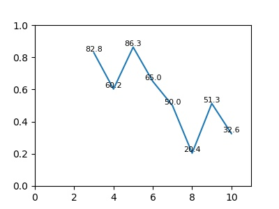

# Gas Detection

### Recommended Environment
* python 3.6
* sklearn
* pandas
* tensorflow 1.8.0
* keras 2.1.6

### Classical Classifiers
* K-Nearest Neighbor (KNN)
* Support Vector Machine (SVM)
* Gaussian Multinomial Naive Bayes (MultinomialNB)
* Decision Tree
* Random Forest
* Extra Tree
* Logistic Regression
* KNN based Bagging
* Logistic Regression
* Majority Voting Ensemble Machine

* *_Neural network_*

### Detection Accuracy
|   classifers   | val acc |
|----------------|---------|
|      KNN       |  85.55  |
|   AdaBoost     |  42.20  |
|LogisticRegression|88.57  |
|DecisionTree    |  89.36  |
|ExtraTrees      | 96.12   |
|KNeighbors      | 82.96   |
|Majority_Voting | 93.39   |
|Naive_Bayes     | 59.31   |
|RandomForest    | 96.33   |
|LinearSVC       | 94.53   |
| Neural network |  99.22  |

### sensor drift 
use first two batches to train &&
use the last eight batchse to test
the results
```
train accuracy : 0.5200065461091564
cross validation acc   : 0.5200065461091564
batch id: 3  acc: 0.8284993694829761
batch id: 4  acc: 0.6024844720496895
batch id: 5  acc: 0.8629441624365483
batch id: 6  acc: 0.65
batch id: 7  acc: 0.49986161084970937
batch id: 8  acc: 0.20408163265306123
batch id: 9  acc: 0.5127659574468085
batch id: 10  acc: 0.32555555555555554
```


### notes
* 传感器特征的构成
* 数据集的每个传感器的8个维度特征大小是不一样的，所以现在的归一化方式存在问题
```
1 9 17....
2 10 18 ...
......
8 16 24 ...
```
分开进行训练